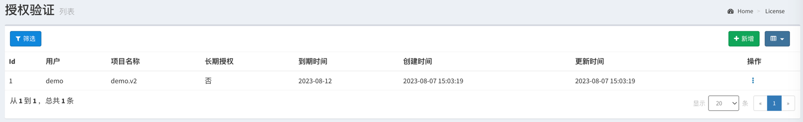
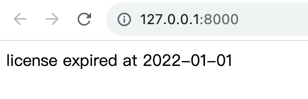

# licheck

###许可证验证

* 1、到 http://licheck.hi15.net:8080/admin *发邮件申请帐户(shuai3970@gmail.com)*
* 2、添加自己的项目
  
* 3、获取插件并发布插件
  ```
  composer require shf/licheck

  php artisan vendor:publish --provider="Shf\LiCheckServiceProvider"
    ```
* 5、.evn 里面添加项目名配置
  ``` 
  LI_PROJECT_NAME="demo.v2" 
  ```
  
* 6、添加中间件 app/Http/Kernel.php 添加 LiCheck::class
  ```
  protected $middlewareGroups = [
        'web' => [
            \App\Http\Middleware\EncryptCookies::class,
            \Illuminate\Cookie\Middleware\AddQueuedCookiesToResponse::class,
            \Illuminate\Session\Middleware\StartSession::class,
            // \Illuminate\Session\Middleware\AuthenticateSession::class,
            \Illuminate\View\Middleware\ShareErrorsFromSession::class,
            \App\Http\Middleware\VerifyCsrfToken::class,
            \Illuminate\Routing\Middleware\SubstituteBindings::class,
            \Shf\Middleware\LiCheck::class

        ],

        'api' => [
            'throttle:60,1',
            'bindings',
        ],
    ];
  ```
  ### 结果

### 自定义错误（可选）

在app/Exceptions/LiCheckException.php路径下修改

```
 public function render()
{
   return $this->getMessage();
}
```


   
